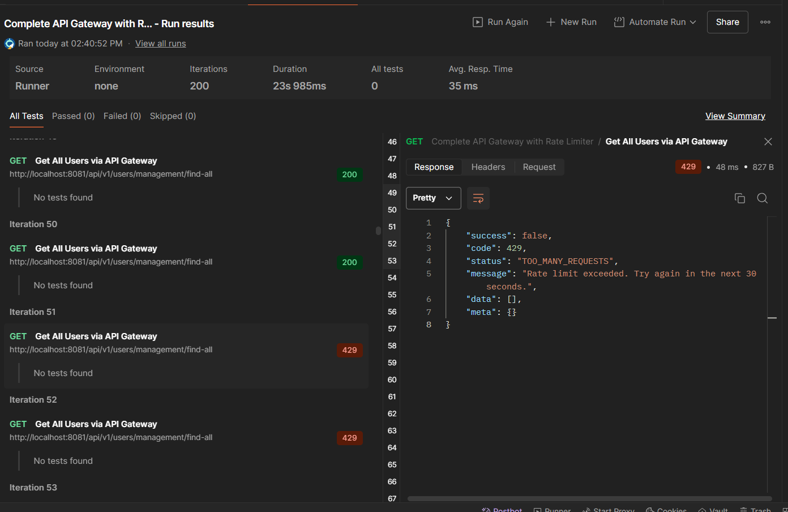

# Complete API Gateway with RateLimiter



## Overview

The Complete API Gateway with RateLimiter is a spring boot app that creates an API gateway that configures rate limit
and prevents a single user from sending multiple request within a specified timeframe.
NB: This API is just a proof of concept, hence, H2 in-memory storage was used.

As you examine the API, be sure to make recommendation or report any issue to the contact listed below.

## Assumption

- Radis is installed on your system

## Table of Contents

- [Complete API Gateway with RateLimiter](#complete-api-gateway-with-ratelimiter)
    - [Overview](#overview)
    - [Assumption](#assumption)
    - [Table of Contents](#table-of-contents)
    - [General Information](#general-information)
    - [Technologies Used](#technologies-used)
    - [Setup](#setup)
        - [Swagger Endpoint Access](#swagger-endpoint-access)
        - [Access the H2 Console](#access-the-h2-console)
    - [Contributor](#contributor)

## General Information

This API captures the basic functionalities of an API gateway including:

* Routing request to user and product microservices.
* Token validation and authentication.
* Rate Limiter.
* Retry feature to retry failed requests.

## Technologies Used

* Language and Frameworks
    * Java Programming Language
    * Java 17
    * Spring Boot 3.4.3

## Setup

Clone the app and open it on your preferred IDE such as IntelliJ IDEA, then open the application.yml file in the gateway
service and update the the redis credentials with yours.
Run the product, user and gateway microservices to test the rate limit.

### RateLimit Test

To test the rate limit, use Apache benchmark to send request with the commands:

Send request to Product service without authorization token:

```
ab -n 200 -c 10 http://localhost:8081/api/v1/products/all
```

Send request to User service with authorization token:
Make sure you sign up and sign in to generate the bearer token with the right endpoints on user microservices and
replace the token below with the generated one.

```
ab -n 200 -c 10 -H "Authorization: Bearer <token>" http://localhost:8081/api/v1/users/management/find-all

```

You can also test the rate limit with Postman via the Runner by sending 100 iterations. 
After the 50th iteration, the gateway returns TOO_MANY_REQUESTS error. The user will be allowed to send another request after 30 seconds.

### Swagger Endpoint Access

User service swagger URL: http://localhost:8082/swagger-ui/index.html

Product service swagger URL: http://localhost:8083/swagger-ui/index.html

### Access the H2 Console

To access the H2 in memory database, open your browser and visit: http://localhost:8082/h2-console/

* JDBC URL: jdbc:h2:mem:user_db_store;DB_CLOSE_DELAY=-1;DB_CLOSE_ON_EXIT=FALSE
* User Name: sa
* Password: password

## Contributor

| Name         | Email                                       | Contact         | Github                                   |
|--------------|---------------------------------------------|-----------------|------------------------------------------|
| Isaiah Omame | omameazy@gmail.com,<br/> omameazy@yahoo.com | +234 7060812940 | [github](https://github.com/OmameIsaiah) |


